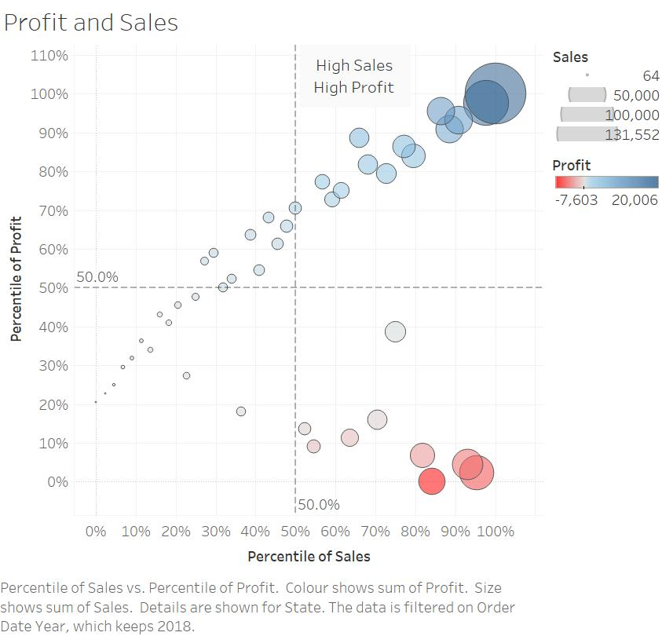

<style> /* A floating TOC, but it's not suitable for long TOC*/
html {
  scroll-behavior: auto; /* change from smooth */
}
d-article {
    contain: none;
    overflow-x: hidden;
  }
#TOC {
  position: fixed; /* float will make the toc fixed */
  z-index: 50; /* priority when the elements overlap each other  */
  background: white;     /* or#ebebeb; */
  /* optional padding: 10px; border-radius: 5px; */
  }

/* Hide the ToC when resized to mobile or tablet:  480px, 768px, 900px */
@media screen and (max-width: 900px) { /* change from 900 */
#TOC {
    position: relative;
  }
}
</style>


```{r setup, include=FALSE}
knitr::opts_chunk$set(echo = FALSE)
```


{width=20%}

word testword testword testword testword testword testword testword testword testword test


```{r, echo = TRUE, eval=FALSE}
1+2
x <- "test 2"
```

word testword testword testword testword testword testword testword testword testword test


```{r, layout='l-body-outset', echo = TRUE, code_folding="True"}
#library(rmarkdown)
#paged_table(py$raw, options = list(rows.print = 5))
print('xxxx')
```

word testword testword testword testword testword testword testword testword testword test

# 1.0 Overview

In this article, we will show you how to plot a figure with multiple histograms by using [**ggplot2**](https://ggplot2.tidyverse.org/) and [__ggpubr__](nyc_taxi_tip_for distill.html) packages. 

<aside>
This is aside note function
<br>
<br>
Note2
</aside>

Test

* to start a new R project, and
* to create a new R Markdown document.

To insert a graph.



Next, you will use the code chunk below to install and launch ggpubr and tidyverse in RStudio.


**No.** | **Step** | **Action**
-- | ------- | ------------------- 
1 | Import the data into Tableau and click "Cleaned with Data Interpreter" to get the cleaned table | {width=50%}
2 | Drag and drop T1 sheet to the canvas area | {width=100%}
3 | Select all the date variables, right click and choose the pivot to make date variables into one | {width=100%}


