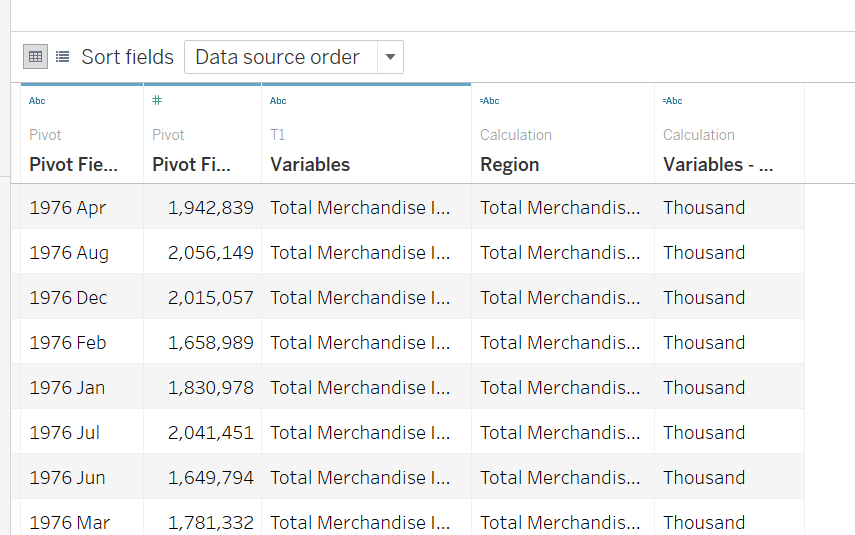

```{r setup, include=FALSE}
knitr::opts_chunk$set(echo = FALSE)
```

# 1.0 Critique of Visualization

The original visualization is shown as below.


### 1.1 Clarity

1. The dual axis in each chart have different ranges. It would make readers difficult to compare imports and exports within one country.

2. The range of y axis in the six charts are not consistent. Readers need extra effort to compare the trade amount among different countries. They have to look at the y-axis scales separately in the six charts to get the numbers of imports and exports.

3. The six charts have different widths. The different widths will disturb readers about how to interpret the change of trade amounts over time. If the width of the same x-axis is bigger in the graph, the data fluctuation will seem to be smaller.

4. The order of the six charts is inaccurate. The title is "Top Six Trading Countries", which makes the reader think that the six charts are ordered by trade amount of each country.


### 1.2 Aesthetic

1. The x-axis scale is confusing. It is not consistent with the axis title. The title is shown as "Month", but the tick marks are year. Besides, the x-axis of the "Japan" is not the same as the x-axis of other countries.

2. Font size and color are confusing. The gray color of the head's font is consistent with the black font of other labels. Besides, the font of the country labels is too large, even larger than the title.

3. The coordinates are repeated six times. They take up so much space in the picture that the area of charts are very small.

# 2.0 Alternative Design
The proposed design is shown as bellow.


### 2.1 Clarity

1. The dual axis use the same scale in the six charts. It makes it easier to compare imports and exports amounts or trade amount among countries.

2. The six charts have the same height and width.

3. The six charts are reorder by the total merchandise trade amount in the period.

### 2.2 Aesthetic

1. The x axis titles are changed to the "Date", consistent with the tick marks. All charts have the same axis.

2. The color of all text is unified. The country fonts have been changed to smaller font sizes to highlight the captions of the images

3. The unnecessary axis title are hidden.

# 3.0 Proposed Visualization


The link to the original dashboard on Tableau Public Server can be found [here](https://public.tableau.com/app/profile/liu.yangguang/viz/A1_16222220286090/trade_by_countries).

# 4.0 Step-by-step Preparation

The original data is from Department of Statistics in Singapore, available under the sub-section of [ Merchandise Trade by Region/Market](https://www.singstat.gov.sg/find-data/search-by-theme/trade-and-investment/merchandise-trade/latest-data).

**No.** | **Step** | **Action**
-- | ------- | ------------------- 
1 | Import the data into Tableau and click "Cleaned with Data Interpreter" to get the cleaned table | {width=50%}
2 | Drag and drop T1 sheet to the canvas area |{width=100%}
3 | Select all the date variables, right click and choose the pivot to make date variables into one  |{width=100%}
4 | Choose the T2 sheet and use the same approach to get the pivoted table |{width=100%}
5 | Right click on the "variables" and select "split" to get the cleaned region name, then rename it into "Region" |{width=100%}
6 | Hide "Variable" and "Variable - split 2" and rename the variables into meaningful name |{width=70%}
7 | Change data type of the "Date" variable from string to date in the two table  |{width=70%}
8 | Edit the connection between two tables to add one rule |{width=80%}
9 | Add the "Date" variable into the Filters panel and select only 2019 and 2020 |{width=100%}
10 | Add the "Region" variable into the Filters panel and select the six region in the original designed visualization  |{width=100%}
11 | Add "Region" and "Date"(month) to the Columns; Add "Exports" to the Rows; Change the marks from Automatic to Area |{width=100%}
12 | Drag the "Imports" to the left of the charts to get the dual axis |{width=100%}
13 | Edit the dual y axis into the same range: 0 to 8,000,000 |{width=100%}
14 | Edit the x axis into the fixed range |{width=100%}
15 | Right click on the "Region" and choose sort to manual sort the six regions by the total merchandise trade amount from 2019 to 2020 |{width=100%}
16 | It's too crowded for the six graph in one columns to read the data trend: Rearrange them into two graph. Duplicate the worksheet and use filter to select the corresponding three countries in the two worksheet  |{width=100%}
17 |  Drag and drop the two worksheet to the dashboard |{width=100%}
18 |  Hide the title and the field labels in the second sheet; Hide the x header in the first sheet; Hide the "Imports" header in the two sheets |{width=100%}
19 |  Rename the title, headers and labels for better clarity |{width=100%}
20 | Change the font and tick color to be consistent and publish the dashboard to Tableau Public |{width=100%}

# 5.0 Derived Insights

1. Singapore has consistently exported much more to Hong Kong than it has imported from China. The trade surplus is the biggest among the six countries. And the merchandise imports from Hong Kong is about the top 2, but exports to Hong Kong are the lowest among the six countries.

2. Singapore has a significant trade deficit with Taiwan. The imports are about twice as large as exports in 2019 and 2020. Moreover, monthly imports and monthly exports fluctuate very closely: they increase and decrease at the same month in 2019 and 2020.

3. The merchandise trade in Singapore is balanced - not overly relies on any single country. There is no big difference in imports, exports or total amounts of the top three countries.


