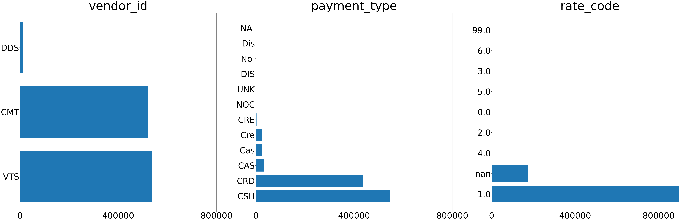
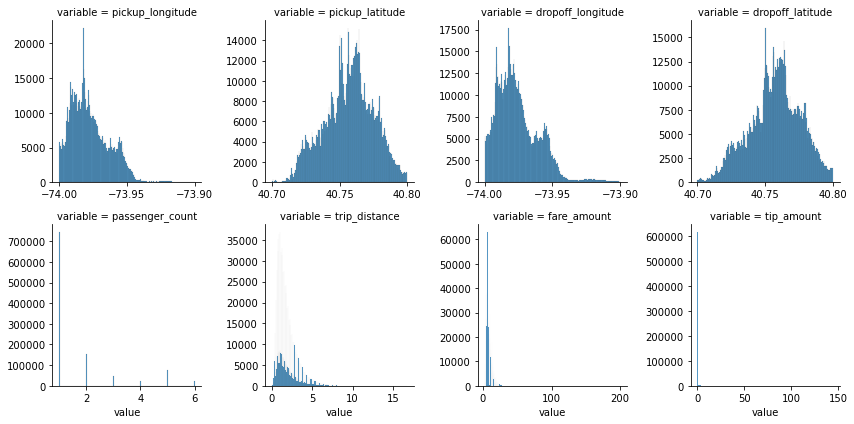
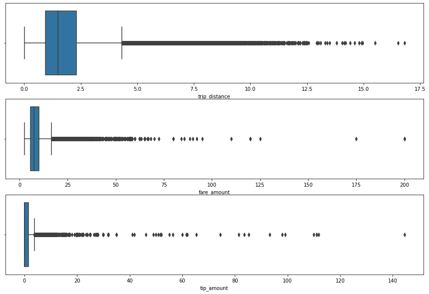
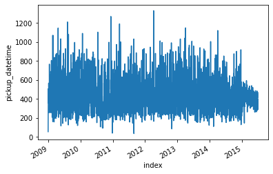

<style> /* A floating TOC, but it's not suitable for long TOC*/
html {
  scroll-behavior: smooth;
}
d-article {
    contain: none;
    overflow-x: hidden;
  }
#TOC {
  position: fixed; /* float will make the toc fixed */
  z-index: 50; /* priority when the elements overlap each other  */
  background: white;     /* or#ebebeb; */
  /* optional padding: 10px; border-radius: 5px; */
  }

/* Hide the ToC when resized to mobile or tablet:  480px, 768px, 900px */
@media screen and (max-width: 900px) { /* change from 900 */
#TOC {
    position: relative;
  }
}
</style>


```{r setup, include=FALSE}
knitr::opts_chunk$set(echo = FALSE)
library(reticulate)
use_python('D:\\Softwares\\Anaconda\\python.exe')
```

## Introduction

The taxi fare amount is decided by trip distance, pickup time and so on. It has a built-in calculation formula and is transparent to the public. But the tip amount doesn't have any fixed rule, which seems to be mostly affected by the qualitative features, such as passengers' mood and drivers' service and friendliness. 

The objective of this study is to build predictive models to predict what factors will influence the taxi tip amount. It would help taxi drivers and online ride-hailing platforms to figure out the important factors and add the revenue.

The python code was written in the jupyter notebook and can be found [here](nyc_taxi_tip_code.html)

## Data Exploration

### Dataset

The dataset originates from New York City [Taxi and Limousine Commission (TLC)](https://www1.nyc.gov/site/tlc/about/tlc-trip-record-data.page). It has 1,071,910 samples and 14 features. And each sample/row represents a trip. 

First, import the data and take a quick peek at how the data looks like.

```{python}
import pandas as pd
import numpy as np
raw = pd.read_csv('taxi_5_row.csv')
```


```{r}
library(kableExtra)
scroll_box(kable_styling(knitr::kable(py$raw[0:5,], format = 'html'),
                         bootstrap_options = c("striped", "hover", "condensed"),
                         full_width = F),
           width = "100%")
```


There are some features could sound a bit strange. The [TLC metadata](https://www1.nyc.gov/assets/tlc/downloads/pdf/data_dictionary_trip_records_yellow.pdf) and [taxi fare explanation page](https://www1.nyc.gov/site/tlc/passengers/taxi-fare.page) give us explanations:

* **vendor_id**: the identifier of the programs that provided the data
* **rate_code**: the identifier of different rates due to the destination, such as trips beyond NYC or airport trips
* **tip_paid**: the boolean value about whether the tip was paid or not

Besides, we can see that the datetime features are in UTC time zone, not the local time zone (US/East).

### Data Exploration

#### Missing value

```{python, echo = TRUE, eval=FALSE}
print(raw.isnull().sum()/len(raw))
```

```{python, echo = FALSE, eval=TRUE}
print('''Missing value percentage for each feature is:
vendor_id            0.000000
pickup_datetime      0.000000
dropoff_datetime     0.000000
pickup_longitude     0.000000
pickup_latitude      0.000000
dropoff_longitude    0.000000
dropoff_latitude     0.000000
rate_code            0.161596
passenger_count      0.000000
trip_distance        0.000000
payment_type         0.000000
fare_amount          0.000000
tip_amount           0.000000
tip_paid             0.000000
dtype: float64
0.16159565635174594''')
```


There is null values only in 'rate_code' and the missing value percentage is significant that we can't just removes these rows with missing values but need to replace them.

#### Check Distributions

```{python, echo = TRUE, eval = FALSE} 
raw.info() 
```

```{python, echo = FALSE, eval=TRUE}
print('''RangeIndex: 1071910 entries, 0 to 1071909
Data columns (total 14 columns):
 #   Column             Non-Null Count    Dtype  
---  ------             --------------    -----  
 0   vendor_id          1071910 non-null  object 
 1   pickup_datetime    1071910 non-null  object 
 2   dropoff_datetime   1071910 non-null  object 
 3   pickup_longitude   1071910 non-null  float64
 4   pickup_latitude    1071910 non-null  float64
 5   dropoff_longitude  1071910 non-null  float64
 6   dropoff_latitude   1071910 non-null  float64
 7   rate_code          898694 non-null   float64
 8   passenger_count    1071910 non-null  int64  
 9   trip_distance      1071910 non-null  float64
 10  payment_type       1071910 non-null  object 
 11  fare_amount        1071910 non-null  float64
 12  tip_amount         1071910 non-null  float64
 13  tip_paid           1071910 non-null  int64  
dtypes: float64(8), int64(2), object(4)
memory usage: 114.5+ MB''')
```

There are 4 categorical features and 10 numerical features. But we know that 'rate_code' is an identifier thus a categorical feature. 

##### Categorical Features

```{python, eval=FALSE, echo=TRUE} 
category_fea = ['vendor_id', 'payment_type', 'rate_code']

fig, ax = plt.subplots(1, 3, figsize=(100, 30))
for i in range(3):
    se = raw[category_fea[i]].value_counts(dropna=False)
    x = [str(x) for x in se.index]
    y = list(se.values)
    p = ax[i].barh(x,y)
    ax[i].tick_params(labelsize=70)
    ax[i].set_title(category_fea[i], fontsize=100)
    ax[i].xaxis.set_ticks(np.linspace(0,800000,3))
```

 

We can find that there are many long tail value in the 'payment_type' and 'rate_code'. Only one or two values dominate the feature. They need to be bucketized later to avoid extremely unbalanced distributions.

And for the 'payment_type'. It has some different values with the same meaning. Like 'Cre' and 'CRE' both refer to the credit card payment. 'CAS' and 'Cas' both refer to the cash payment.

Besides, we don't plot the two datetime features here because they are the combination of date and time and have hundreds of thousands unique values. The distribution will be displayed after the data transformation.

##### Numerical Features

```{python, eval=FALSE, echo=TRUE}
numerical_fea = ['pickup_longitude', 'pickup_latitude', 'dropoff_longitude', 'dropoff_latitude', 
                  'passenger_count', 'trip_distance', 'fare_amount', 'tip_amount']

f = pd.melt(raw, value_vars=numerical_fea) # melt the col
g = sns.FacetGrid(f, col="variable",  col_wrap=4, sharex=False, sharey=False)
g = g.map(sns.histplot, "value")
```


The four latitude and longitude features approximately follow normal distributions, but we can't put them into the model without processing. The locations, which can be regard as binning of geography features, are more important than values.

```{python, echo=TRUE, eval=FALSE}
raw[['trip_distance','fare_amount','tip_amount']].describe(
    percentiles=[.25, .50, .75, .99, .999])
```

```{python, echo=FALSE, eval=TRUE}
con_fea = pd.read_csv('con_fea.csv') # pass the result file of above code 
```

```{r}
kable_styling(knitr::kable(py$con_fea, format = 'html'),
                         bootstrap_options = c("striped", "hover", "condensed"),
                         full_width = F)
```


And 'trip_distance', 'fare_amount' and 'tip_amount' all have extremely outliers. Take 'tip_amount' as an example, 99.9% values are less than 7, but the max value reaches 144.4. It's the same situation with 'trip_amount' and 'fare_amount'. Because this study will focus on how much the tip amount would be in the general situation instead of the extreme situations, these outliers will be excluded later.


 
## Feature Engineering

#### Missing value

We can take a look at the rows with missing value by the handy function below.

```{python, eval=FALSE, echo=TRUE}
import pandas_profiling

df_null = raw.iloc[list(raw['rate_code'].isnull()),:] # filter out the rows with missing value
report = pandas_profiling.ProfileReport(df_null)
report.to_widgets()
```

The result can be found [here](row_with_missing.html). But  there is nothing special about the feature distribution in these rows. Thus, we would not process from rows.

We can only replace the missing value from its distribution. Because one value take the majority, we will group the missing value and other values into one group.

```{python, echo=TRUE, eval=FALSE}
raw['rate_code_group'] = raw['rate_code'].apply(lambda x:'1' if x == 1.0 else 'Others')
# check the new distribution
print(raw['rate_code_group'].value_counts())
```

```{python, echo = FALSE, eval=TRUE}
print('''1         896903
Others    175007
Name: rate_code_group, dtype: int64''')
```


#### Outliers

```{python, eval=FALSE, echo=TRUE}
# draw the box plot
fig,ax2 = plt.subplots(3,1,figsize=(15,10))
sns.boxplot(x="trip_distance", data=raw, ax=ax2[0])
sns.boxplot(x="fare_amount",  data=raw, ax=ax2[1])
sns.boxplot(x="tip_amount", data=raw, ax=ax2[2])
# clean outliers
idx = (raw['tip_amount'] < 30) & (raw['fare_amount'] < 60) & (raw['trip_distance'] < 12.5)
raw_clean = raw.loc[idx]
```



We excluded 83 extreme outlier samples out of the 1 million raw data. It will help improve the model performance as well as robustness. 

#### Datetime

The datetime features are transformed from string to datetime and switch to the local timezone in the New York. Thus we can get the real datetime data. We can find that the date cover from 2009 to 2015.

```{python, eval=FALSE, echo=TRUE}
# convert the string into datetime
raw_clean['pickup_datetime'] = raw_clean['pickup_datetime'].apply(
    lambda dt: datetime.strptime(dt, "%Y-%m-%d %H:%M:%S%z"))
# convert time zone
us_east = timezone('US/Eastern')
raw_clean['pickup_datetime'] = raw_clean['pickup_datetime'].apply(
    lambda dt: dt.astimezone(us_east))

# do the same transformation for dropoff datetime
raw_clean['dropoff_datetime'] = raw_clean['dropoff_datetime'].apply(
    lambda dt: datetime.strptime(dt, "%Y-%m-%d %H:%M:%S%z"))
raw_clean['dropoff_datetime'] = raw_clean['dropoff_datetime'].apply(
    lambda dt: dt.astimezone(us_east))
# take a look at the date distribution
time_date = raw_clean['pickup_datetime'].apply(lambda dt: dt.date)
time_date_count = time_date.value_counts().reset_index().sort_values(by='index', ascending=True)
sns.lineplot(x='index', y='pickup_datetime', data=time_date_count)
plt.gcf().autofmt_xdate() # format the date x-axis
```



Instead of using these datetime features, we need to extract some new features from them to put in models:

* **pickup_hour**: The number of hour when the pickup happened (24 hour-hour clock)
* **pickup_weekday**: The weekday name when the pickup happened
* **pickup_month**: The month name when the pickup happened
* **pickup_year**: The year number when the pickup happened
* **min_period**: The minutes between pickup time and dropoff time

```{python, eval=FALSE, echo=TRUE}
# get the hour number of pickup time
raw_clean['pickup_hour'] = raw_clean['pickup_datetime'].apply(lambda dt: int(dt.hour))
# get the weekday
raw_clean['pickup_weekday'] = raw_clean['pickup_datetime'].apply(lambda dt: dt.strftime("%A"))
# get the month of the year
raw_clean['pickup_month'] = raw_clean['pickup_datetime'].apply(lambda dt: dt.strftime("%b"))
# get the year
raw_clean['pickup_year'] = raw_clean['pickup_datetime'].apply(lambda dt: str(dt.year))
# get the time period (minitues) between pickup and dropoff
timeperiod = raw_clean['dropoff_datetime'] - raw_clean['pickup_datetime']
raw_clean['min_period'] = timeperiod.apply(lambda x: float(x.seconds/60))
```

#### Geography Features

We can draw the scatter plot between longitude and latitude.

```{python, eval=FALSE, echo=TRUE}
fig, ax4 = plt.subplots(figsize=(100, 100))

ax4.scatter('pickup_longitude', 'pickup_latitude', data=raw_clean, s=5, color='blue', alpha=0.5)
ax4.scatter('dropoff_longitude', 'dropoff_latitude', data=raw_clean, s=5, color='red', alpha=0.5)
```


The high density area is Manhattan actually. The points seems to draw many grids, which might corresponds to the building. It would be a good idea to name the geography location into the corresponding neighborhood. But that need much more computation resource and dataset. Here we take a simple but still useful method: bin the longitude and latitude.

#### Binning

```{python, eval=FALSE, echo=TRUE}
# bucketize longgitude & lagitude by percentile
raw_clean['pickup_lo_cut'] = pd.cut(raw_clean['pickup_longitude'], 20)
raw_clean['pickup_la_cut'] = pd.cut(raw_clean['pickup_latitude'], 20)
raw_clean['dropoff_lo_cut'] = pd.cut(raw_clean['dropoff_longitude'], 20)
raw_clean['dropoff_la_cut'] = pd.cut(raw_clean['dropoff_latitude'], 20)
```

We bucketize the four geography feature into 20 bins.

And the 'payment_type' also need to be bucketing since it has long tail values.

```{python, eval=FALSE, echo=TRUE} 
# combine 'Cre' and 'CRE', 'Cas' and 'CAS'
raw_clean['payment_type_group'] = raw_clean['payment_type'].apply(lambda x: str.upper(x))
# combine the minor into one group
raw_clean['payment_type_group'] = raw_clean['payment_type_group'] = raw_clean['payment_type_group'].apply(
    lambda x: 'Other' if x not in ['CSH','CRD','CAS','CRE'] else x)
```

Besides, the 'pickup_hour' should be divided into groups as well. Here we bin 24 hours into 4 time period: 'Midnight'(0-6), 'Morning'(6-12), 'Afternoon'(12-18), 'Evening'(18-23)

```{python, eval=FALSE, echo=TRUE} 
# group the pickup hour
bins = [0, 6, 12, 18, 23]
raw_clean['pickup_hour_group'] = pd.cut(raw_clean['pickup_hour'], bins, include_lowest = True,
                                        labels=['Midnight', 'Morning', 'Afternoon', 'Evening'])
```

After these data transformation, we can exclude some old features and keep the new features extracted from them. Then we can get a new dataset with 16 features.

```{python, eval=FALSE, echo=TRUE} 
drop_list = ['pickup_datetime', 'dropoff_datetime', 'pickup_longitude',
             'pickup_latitude', 'dropoff_longitude', 'dropoff_latitude', 
             'rate_code', 'payment_type', 'pickup_hour', 'tip_paid']

raw_clean = raw_clean.drop(drop_list, axis=1)
```


The last step before modelling is to perform one-hot encoding for categorical variables:

```{python, eval=FALSE, echo=TRUE} 
dummy_list = ['vendor_id', 'rate_code_group', 'pickup_hour_group', 'pickup_weekday',
              'pickup_month', 'pickup_year', 'pickup_lo_cut', 'pickup_la_cut', 
              'dropoff_lo_cut', 'dropoff_la_cut', 'payment_type_group']

raw_clean_dummy = pd.get_dummies(raw_clean, columns=dummy_list, drop_first=True)
```


## Model

### Model Building

The linear regression would not perform well since the distribution of the independent features and target feature. Thus, We will use a decision tree as our base model. And ensemble learning models based on the decision tree will be built to make comparison. The objective metrics is root-mean-square error ([RMSE](https://en.wikipedia.org/wiki/Root-mean-square_deviation)).

First, the cleansed data are split into train data and test data.

```{python, eval=FALSE, echo=TRUE} 
x_train, x_test, y_train, y_test = train_test_split(
    raw_clean_dummy.drop(['tip_amount'], axis=1), raw_clean_dummy['tip_amount'], test_size=0.2)
```

The base model is decision tree regressor. The calculated RMSE on the test data is 0.6747.

```{python, eval=FALSE, echo=TRUE} 
base = DecisionTreeRegressor(criterion='mse', min_samples_leaf = 3, random_state = 2021)

dt = base.fit(x_train, y_train)
base_pred = dt.predict(x_test)
base_rmse = metrics.mean_squared_error(base_pred, y_test, squared = False)
```

The ensemble learning models we use are Random Forest, AdaBoost and Gradient Boosting. To get the optimal hyperparameter combination, we will split the train data into the train and the validation. And the KFold cross validation is used in hyperparameter tuning because it can ensure more “trustable” estimation.

The hyperparameters chosen to test are mostly related to the model complexity. The complexity model might not always get better performance. So we want to test and get the optimal model with different complexity.

#### **Random Forest**

```{python, eval=FALSE, echo=TRUE} 
# 5 fold cross validation
cv_fold = KFold(n_splits=5, random_state=2021, shuffle=True)

# RandomForestRegressor
model_rf = ensemble.RandomForestRegressor()
# the hyperparameter range to tune
para_rf = {"n_estimators": [40, 60, 80, 100, 120],
        "max_depth": range(4,11,1),
        "min_samples_split": range(3,11,1)} 

# hyperparameter tunning
rf_randomd_search = RandomizedSearchCV(estimator=model_rf,
                                       cv=cv_fold,
                                       n_iter = 5, 
                                       param_distributions= para_rf,
                                       scoring='neg_root_mean_squared_error',
                                       n_jobs = -1) # use all processors
# fit the train data
rf = rf_randomd_search.fit(x_train, y_train)
# Train the model again with the calculated best parameters
rf_best_para = rf.best_params_
rf_best = ensemble.RandomForestRegressor(n_estimators = rf_best_para["n_estimators"],
                                         max_depth = rf_best_para["max_depth"],
                                         min_samples_split = rf_best_para['min_samples_split'],
                                         random_state = 2021)
rf_best.fit(x_train, y_train)

# predict on the test data
rf_pred = rf_best.predict(x_test)
# calculate the RMSE
rf_rmse = metrics.mean_squared_error(y_test, rf_pred, squared = False)
print('The RMSE of RandomForestRegressor on the test data is', rf_rmse)

# Print the top 5 important feature
col = x_train.columns
rf_fea_importance = rf_best.feature_importances_
rf_index = np.argsort(rf_fea_importance)[::-1]
for i in range(5):
    print(f'No.{i+1}, {col[rf_index[i]]}')
```

#### **AdaBoost**

```{python, eval=FALSE, echo=TRUE} 
model_ada = ensemble.AdaBoostRegressor()
# the hyperparameter range to be test
para_ada = {"n_estimators": [40, 60, 80, 100, 120],
            "learning_rate": [0.1, 0.5, 1]}

# hyperparameter tunning
ada_randomd_search = RandomizedSearchCV(estimator=model_ada,
                                        cv=cv_fold,
                                        n_iter = 5, 
                                        param_distributions= para_ada,
                                        scoring='neg_root_mean_squared_error',
                                        n_jobs = -1)
# fit the train data
ada = ada_randomd_search.fit(x_train, y_train)
# Train the model again with the calculated best parameters
ada_best_para = ada.best_params_
ada_best = ensemble.AdaBoostRegressor(n_estimators = ada_best_para["n_estimators"],
                                      learning_rate = ada_best_para["learning_rate"],
                                      random_state=2021)
ada_best.fit(x_train, y_train)

# predict on the test data
ada_pred = ada_best.predict(x_test)
# calculate the RMSE
ada_rmse = metrics.mean_squared_error(y_test, ada_pred, squared = False)
print('The RMSE of AdaBoostRegressor on the test data is', ada_rmse)

# Print the top 5 important feature
ada_fea_importance = ada_best.feature_importances_
ada_index = np.argsort(ada_fea_importance)[::-1]
for i in range(5):
    print(f'No.{i+1}, {col[ada_index[i]]}')
```

#### **GradientBoosting**

```{python, eval=FALSE, echo=TRUE} 
model_gbr = ensemble.GradientBoostingRegressor()
# the hyperparameter range to be test
pare_gbr = {"loss": ['ls', 'lad', 'huber'],
            "n_estimators": [50, 100, 150],
            "learning_rate": [0.1, 0.5, 1],
            "min_samples_split": [4,8]}

# hyperparameter tunning
gbr_randomd_search = RandomizedSearchCV(estimator=model_gbr,
                                        cv=cv_fold,
                                        n_iter = 5,
                                        param_distributions= pare_gbr,
                                        scoring='neg_root_mean_squared_error',
                                        n_jobs = -1)
# fit the train data
gbr = gbr_randomd_search.fit(x_train, y_train)

# Train the model again with the calculated best parameters
gbr_best_para = gbr.best_params_
gbr_best = ensemble.GradientBoostingRegressor(loss = gbr_best_para["loss"],
                                              n_estimators = gbr_best_para["n_estimators"],
                                              learning_rate = gbr_best_para["learning_rate"],
                                              min_samples_split = gbr_best_para["min_samples_split"],
                                              random_state = 2021)
gbr_best.fit(x_train, y_train)

# predict on the test data
gbr_pred = gbr_best.predict(x_test)
# calculate the RMSE
gbr_rmse = metrics.mean_squared_error(y_test, gbr_pred, squared = False)
print('The RMSE of GradientBoostingRegressor on the test data is', gbr_rmse)

# Print the top 5 important feature
gbr_rea_importance = gbr_best.feature_importances_
gbr_index = np.argsort(gbr_rea_importance)[::-1]
for i in range(5):
    print(f'No.{i+1}, {col[gbr_index[i]]}')

```

### Conclusion

The model performance on the test data is below:

| **Classifier** | **Decidion Tree** | **RandomForest** | **AdaBoost** | **GradientBoosting** |
| --- | --- | --- | --- | --- |
| **RMSE** | 0.6747 | 0.5317 | 0.6182 | 0.5322 | 

We can find that the overall three ensemble learning models reduce the RMSE compared with the base model. And Random Forest is the best with the 0.5317 on RMSE, while the gradient boosting performs nearly well.

Furthermore, we print the five most important features in the three models:

| **Classifier** | **RandomForest** | **AdaBoost** | **GradientBoosting** |
| --- | --- | --- | --- |
| Feature 1 | payment_type_group_CRD | payment_type_group_CRD | payment_type_group_CRD | 
| Feature 2 | fare_amount | fare_amount | fare_amount | 
| Feature 3 | payment_type_group_CRE | trip_distance | payment_type_group_CRE | 
| Feature 4 | min_period | payment_type_group_CRE | min_period | 
| Feature 5 | vendor_id_VTS | payment_type_group_CSH | payment_type_group_Other | 

Surprisingly, the top two important features are the same in the three models. Whether the taxi trip is paid by 'CRD' is the most important. And the 'fare_amount' is the second important. It implies that the tip amount would be bigger if the fare amount is bigger and the payment type is 'CRD'. 

Besides, different payment type has different influence on the tip amount but many but all payment types are very important in models.

And the 'min_period' and 'trip_distance' are important as well. They can be explained as the same with 'fare_amount'. A longer trip in distance or driving time will usually have a larger fare amount. And such trip will get a larger tip amount.

## Future Work

This study is based on my assignment in the machine learning course. There are many parts to improve when time is enough:

* The geography features were simply binning. But a better processing approach can be combine the latitude and longitude to get the real neighborhoods and we would find which specific area are more likely to get a higher tip amount

* The date features can consider the holiday date, which intuitively is an important feature in tipping . It need to manually collect the holiday data from 2009 to 2015 because there is complete datasets with one-click

* The business analysis part is brief. It's partially because the dataset provided in class has minor difference with the dataset in New York City TLC. And the metadata cannot correspond completely and some values of features don't have definition

* The EDA can explore more about the relationships between trip features and the tipping

